# End-to-End Architecture Diagram

```mermaid
flowchart TD
    %% ─────────────────────────────────────────────
    %% EXTERNAL DATA SOURCE
    %% ─────────────────────────────────────────────
    subgraph EXT["External Data Source"]
        CS["Cricsheet\n5,100+ T20 JSON files\n17,834-player registry CSV"]
    end

    %% ─────────────────────────────────────────────
    %% STORAGE LAYER
    %% ─────────────────────────────────────────────
    subgraph VOL["Databricks Volume (Unity Catalog)"]
        V1["/Volumes/tabular/dataexpert/\nprateek_capstone_project/\n*.json + people.csv"]
    end

    %% ─────────────────────────────────────────────
    %% BRONZE LAYER
    %% ─────────────────────────────────────────────
    subgraph BRZ["01_bronze_ingestion.py — Bronze Layer"]
        B1["PySpark binaryFile reader\n(reads raw JSON bytes)"]
        B2["json (stdlib)\nparse_match_json()"]
        B3["mapInPandas\n(distributed Python)"]
        B4["Pandas\n(row-wise DataFrame construction)"]
        B5["pyspark.sql.types\n(StructType schema enforcement)"]
        B6["Delta Lake\n.write.format('delta').mode('overwrite')"]
        B1 --> B2 --> B3 --> B4 --> B5 --> B6
    end

    subgraph BD["Bronze Delta Tables (Unity Catalog)"]
        BT1["bronze_deliveries\n~1.2M rows\nPartitioned: gender / season"]
        BT2["bronze_quality_log\n(null checks, value ranges)"]
    end

    %% ─────────────────────────────────────────────
    %% SILVER LAYER
    %% ─────────────────────────────────────────────
    subgraph SLV["02_silver_enrichment.py — Silver Layer"]
        S1["PySpark SQL filter\n(male T20, no super overs)"]
        S2["pyspark.sql.functions\n(F.when, F.col, F.count, F.window)"]
        S3["pyspark.sql.Window\n(batting_position ranking per innings)"]
        S4["DateType cast\n(match_date → DateType)"]
        S5["Derived columns\n(phase, is_legal, is_boundary,\nruns_for_bowler, is_bowler_wicket)"]
        S6["Delta Lake\n.write.format('delta').mode('overwrite')\n+ OPTIMIZE ZORDER BY (batter_id, bowler_id, match_date)"]
        S1 --> S2 --> S3 --> S4 --> S5 --> S6
    end

    subgraph SD["Silver Delta Tables (Unity Catalog)"]
        ST1["silver_deliveries\n~728K rows\nPartitioned: season\nZ-ORDERED: batter_id, bowler_id, match_date"]
        ST2["silver_quality_log"]
    end

    %% ─────────────────────────────────────────────
    %% GOLD LAYER
    %% ─────────────────────────────────────────────
    subgraph GLD["03_gold_layer.py — Gold Layer"]
        G1["PySpark aggregations\n(groupBy, agg, alias)"]
        G2["pyspark.sql.Window\n(stddev, lag, rank)"]
        G3["Pandas\n(people.csv registry join)"]
        G4["Z-score calculation\n(sr_zscore, dot_zscore in PySpark SQL)"]
        G5["impact_score formula\n(35% SR + 30% avg + 20% boundary%\n+ 15% dot-avoidance)"]
        G6["Anomaly severity classification\nHIGH ≥2.5 / MEDIUM ≥1.5 / LOW ≥0.5"]
        G7["Delta Lake\n.write.format('delta').mode('overwrite')"]
        G1 --> G2 --> G3 --> G4 --> G5 --> G6 --> G7
    end

    subgraph GD["Gold Delta Tables (Unity Catalog)"]
        GT1["gold_batter_career\n~1.5K rows"]
        GT2["gold_batter_by_match\n~85K rows"]
        GT3["gold_batter_by_phase\n~4K rows"]
        GT4["gold_bowler_career\n~1.2K rows"]
        GT5["gold_bowler_by_match\n~70K rows"]
        GT6["gold_bowler_by_phase\n~3.5K rows"]
        GT7["gold_phase_momentum\n~25K rows"]
        GT8["gold_matchup (H2H)\n~45K rows"]
        GT9["gold_anomaly_feed\n~518 flagged rows"]
        GT10["gold_quality_log"]
    end

    %% ─────────────────────────────────────────────
    %% AGENTIC AI LAYER
    %% ─────────────────────────────────────────────
    subgraph AGT["04_agentic_ai.py — Agentic Loop"]
        direction TB
        A1["OBSERVE\nRead gold_anomaly_feed\n(anomaly_flag = True)"]
        A2["REASON\nai_query() Databricks SQL function\n→ Meta Llama 3.3 70B\n(narrative + recommendation)"]
        A3["DECIDE\nRoute by Z-score:\n≥2.5 → ALERT\n≥1.5 → WATCHLIST\nelse → LOG"]
        A4["ACT\nDelta Lake writes\n(append mode)"]
        A1 --> A2 --> A3 --> A4
    end

    subgraph AD["Agent Delta Tables (Unity Catalog)"]
        AT1["anomaly_narratives\n~518 rows (AI text)"]
        AT2["agent_alerts\n(HIGH severity)"]
        AT3["agent_watchlist\n(MEDIUM severity)"]
        AT4["agent_actions\n(full audit log, append)"]
    end

    %% ─────────────────────────────────────────────
    %% ALERTS & SCHEDULING
    %% ─────────────────────────────────────────────
    subgraph SCH["06_sql_alerts.py — Alerts & Scheduling"]
        SC1["databricks-sdk\nWorkspaceClient()"]
        SC2["w.queries.create()\n(named SQL queries)"]
        SC3["w.alerts.create()\n(AlertCondition, AlertOperator)"]
        SC4["w.jobs.create()\n(CronSchedule: daily 06:00 UTC)"]
        SC1 --> SC2 --> SC3
        SC1 --> SC4
    end

    subgraph SCA["Alerts & Jobs (Databricks Workspace)"]
        SA1["SQL Alert: HIGH count > 0\n(email notification)"]
        SA2["SQL Alert: MEDIUM count > 5\n(email notification)"]
        SA3["Scheduled Job\nNotebook 04 daily @ 06:00 UTC"]
    end

    %% ─────────────────────────────────────────────
    %% AIBI DASHBOARD
    %% ─────────────────────────────────────────────
    subgraph AIB["05_aibi_dashboard.py — Native Dashboard"]
        AB1["Databricks AI/BI\n(JSON widget config)"]
        AB2["Databricks SQL Warehouse\nb15d3d6f837ba428"]
    end

    %% ─────────────────────────────────────────────
    %% EXPORT (OPTIONAL)
    %% ─────────────────────────────────────────────
    subgraph EXP["07_export_gold_to_csv.py — Static Export"]
        E1["spark.table().toPandas()"]
        E2["Pandas .to_csv()"]
        E3["DBFS: dbfs:/FileStore/\ncapstone_exports/*.csv"]
        E1 --> E2 --> E3
    end

    %% ─────────────────────────────────────────────
    %% DASH WEB APPLICATION
    %% ─────────────────────────────────────────────
    subgraph APP["app/app.py — Dash Web Application"]
        direction TB
        AP1["Authentication\n(DATABRICKS_TOKEN env var\n→ Databricks CLI profile\n→ WorkspaceClient OAuth M2M)"]
        AP2["databricks-sql-connector\nsql.connect() → SQL Warehouse"]
        AP3["threading\n(thread-safe connection pool)"]
        AP4["subprocess\n(CLI token retrieval)"]
        AP5["python-dotenv\n(.env file loading)"]
        AP6["sqlite3 (stdlib)\n(in-memory SQL for CSV fallback)"]
        AP7["Pandas\n(query results → DataFrames)"]

        subgraph P1["Page 1 — Player Scout (/)"]
            PA1["Dash dcc.Dropdown\n(player select)"]
            PA2["Dash html + dcc components\n(stats grid, phase breakdown)"]
            PA3["Plotly go.Scatter\n(SR trend chart)"]
            PA4["AI Verdict\n(anomaly_narratives lookup)"]
        end

        subgraph P2["Page 2 — Anomaly Feed (/anomaly)"]
            PB1["Dash Input callbacks\n(signal/player type/Z-score filters)"]
            PB2["gold_anomaly_feed query\n+ anomaly_narratives JOIN"]
            PB3["Animated anomaly cards\n(CSS3 pulse vs slump)"]
        end

        subgraph P3["Page 3 — Matchup Intel (/matchup)"]
            PC1["Dual Dropdowns\n(batter + bowler select)"]
            PC2["gold_matchup H2H query"]
            PC3["Live ai_query() call\n→ Llama 3.3 70B matchup brief"]
            PC4["Dangermen table\n(top 6 bowlers by dismissal rate)"]
        end

        AP1 --> AP2 --> AP3
        AP5 --> AP1
        AP4 --> AP1
        AP2 --> AP7
        AP6 --> AP7
        AP7 --> P1
        AP7 --> P2
        AP7 --> P3
    end

    subgraph HOSTING["Deployment"]
        H1["app.yaml\n(Databricks Apps manifest)"]
        H2["gunicorn\n(WSGI server)"]
        H3["Databricks Apps\n(serverless container hosting)"]
        H4["CSS3 / Inter font\nassets/style.css (640 lines)\n(dark theme, animations)"]
        H1 --> H3
        H2 --> H3
        H4 --> H3
    end

    %% ─────────────────────────────────────────────
    %% DATA FLOW CONNECTIONS
    %% ─────────────────────────────────────────────
    CS -->|"uploaded to"| V1
    V1 -->|"binaryFile read"| B1
    B6 --> BT1 & BT2
    BT1 -->|"read via spark.table()"| S1
    S6 --> ST1 & ST2
    ST1 -->|"read via spark.table()"| G1
    G7 --> GT1 & GT2 & GT3 & GT4 & GT5 & GT6 & GT7 & GT8 & GT9 & GT10
    GT9 -->|"read anomaly_flag=True"| A1
    A4 --> AT1 & AT2 & AT3 & AT4
    AT2 -->|"query count"| SC2
    AT3 -->|"query count"| SC2
    SC3 --> SA1 & SA2
    SC4 --> SA3
    SA3 -->|"triggers notebook 04"| A1
    GT1 & GT2 & GT3 & GT4 & GT5 & GT6 & GT7 & GT8 & GT9 -->|"SQL Warehouse queries"| AB2
    AB2 --> AB1
    GT1 & GT2 & GT3 & GT4 & GT5 & GT6 & GT7 & GT8 -->|"toPandas + to_csv"| E1
    E3 -->|"CSV fallback"| AP6
    GT1 & GT2 & GT3 & GT4 & GT5 & GT6 & GT7 & GT8 & GT9 & AT1 -->|"databricks-sql-connector"| AP2
    APP --> HOSTING

    %% ─────────────────────────────────────────────
    %% STYLING
    %% ─────────────────────────────────────────────
    classDef ext fill:#2d4a6e,stroke:#5b8dd9,color:#fff
    classDef storage fill:#1e3a2f,stroke:#3d8b5e,color:#fff
    classDef bronze fill:#5c3a1e,stroke:#c47a2e,color:#fff
    classDef silver fill:#3a3a4a,stroke:#8888bb,color:#fff
    classDef gold fill:#4a3a00,stroke:#c8a000,color:#fff
    classDef agent fill:#3a1e4a,stroke:#9b59b6,color:#fff
    classDef alert fill:#4a1e1e,stroke:#c0392b,color:#fff
    classDef app fill:#1e3a4a,stroke:#2980b9,color:#fff
    classDef deploy fill:#1e4a3a,stroke:#27ae60,color:#fff

    class EXT,CS ext
    class VOL,V1 storage
    class BRZ,B1,B2,B3,B4,B5,B6,BD,BT1,BT2 bronze
    class SLV,S1,S2,S3,S4,S5,S6,SD,ST1,ST2 silver
    class GLD,G1,G2,G3,G4,G5,G6,G7,GD,GT1,GT2,GT3,GT4,GT5,GT6,GT7,GT8,GT9,GT10 gold
    class AGT,A1,A2,A3,A4,AD,AT1,AT2,AT3,AT4 agent
    class SCH,SC1,SC2,SC3,SC4,SCA,SA1,SA2,SA3,AIB,AB1,AB2,EXP,E1,E2,E3 alert
    class APP,AP1,AP2,AP3,AP4,AP5,AP6,AP7,P1,PA1,PA2,PA3,PA4,P2,PB1,PB2,PB3,P3,PC1,PC2,PC3,PC4 app
    class HOSTING,H1,H2,H3,H4 deploy
```



---

## Tool Order Summary (Linear View)

```
Cricsheet (JSON/CSV)
  └─► Unity Catalog Volume

[BRONZE — 01_bronze_ingestion.py]
  PySpark binaryFile → json (stdlib) → mapInPandas → Pandas → pyspark.sql.types → Delta Lake
  → bronze_deliveries, bronze_quality_log

[SILVER — 02_silver_enrichment.py]
  PySpark SQL filter → pyspark.sql.functions → pyspark.sql.Window → DateType cast
  → Delta Lake + ZORDER
  → silver_deliveries, silver_quality_log

[GOLD — 03_gold_layer.py]
  PySpark aggregations → pyspark.sql.Window → Pandas (registry join) → Z-score (PySpark SQL)
  → impact_score formula → anomaly severity rules → Delta Lake (9 tables)
  → gold_* tables

[AGENTIC AI — 04_agentic_ai.py]
  gold_anomaly_feed → ai_query() → Meta Llama 3.3 70B → Z-score routing → Delta Lake (append)
  → anomaly_narratives, agent_alerts, agent_watchlist, agent_actions

[ALERTS & SCHEDULING — 06_sql_alerts.py]
  databricks-sdk (WorkspaceClient) → w.queries.create() → w.alerts.create() → w.jobs.create()
  → 2 SQL Alerts (email) + 1 daily Cron Job

[AIBI DASHBOARD — 05_aibi_dashboard.py]
  Databricks SQL Warehouse → Databricks AI/BI native dashboard

[EXPORT — 07_export_gold_to_csv.py]
  spark.table() → Pandas → DBFS CSV files

[DASH APP — app/app.py]
  python-dotenv → Auth (env var / CLI subprocess / OAuth M2M)
  → databricks-sql-connector → threading (connection pool)
  → Pandas → Dash + Plotly + Dash Bootstrap Components
  → [CSV fallback: sqlite3 in-memory]
  → 3 pages served via gunicorn

[DEPLOYMENT — app/app.yaml]
  app.yaml → Databricks Apps (serverless container) + CSS3 dark theme
```
